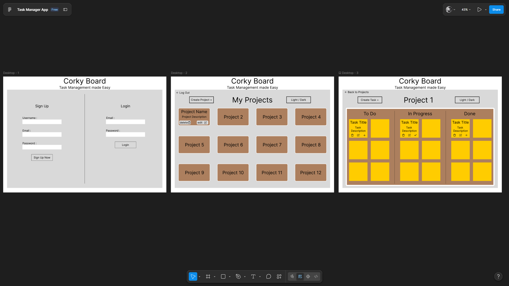

# CorkyBoard

CorkyBoard is a full-stack task management app for organizing work into projects and tasks. Users can create an account, manage their own projects, and track tasks through a simple status workflow.

This application was built as a class project.

## Original Idea Figma


## Features

- Create an account and log in with email and password.
- Create, view, edit, and delete projects.
- Add, edit, and delete tasks within a project.
- Move tasks between **To Do**, **In Progress**, and **Done**.
- Protect project and task routes with JWT authentication and project ownership checks.

## Tech stack

- **Frontend:** React, TypeScript, Vite, Tailwind CSS
- **Backend:** Node.js, Express
- **Database:** MongoDB with Mongoose
- **Authentication:** JSON Web Tokens and bcrypt

## Project structure

```text
backend/   Express API, Mongoose models, and authentication
frontend/  React and TypeScript client
```

## Run locally

### Requirements

- Node.js and npm versions compatible with Vite 8
- A MongoDB database, local or hosted

### 1. Configure the backend

Create `backend/.env`:

```dotenv
PORT=3001
MONGO_URI=mongodb+srv://<username>:<password>@<cluster>/<database>?retryWrites=true&w=majority
JWT_SECRET=replace_with_a_long_random_secret
CLIENT_URL=http://localhost:5173
```

Use your own MongoDB connection string and a private JWT secret. Do not commit `.env` files or publish secret values.

Install dependencies and start the API:

```powershell
cd backend
npm ci
npm run dev
```

The API listens on `http://localhost:3001` by default.

### 2. Start the frontend

In a second terminal:

```powershell
cd frontend
npm ci
npm run dev
```

Open the local URL printed by Vite (usually `http://localhost:5173`). During development, Vite forwards `/api` requests to the local backend. For local use, leave `VITE_API_BASE_URL` unset.

## API overview

All project and task endpoints require the JWT returned by registration or login in the `Authorization` request header, using the `Bearer` scheme.

| Method | Endpoint | Description |
| --- | --- | --- |
| `POST` | `/api/user/register` | Register an account |
| `POST` | `/api/user/login` | Log in |
| `GET` | `/api/user` | Get the authenticated user |
| `GET` | `/api/projects` | List the authenticated user's projects |
| `POST` | `/api/projects` | Create a project |
| `GET` | `/api/projects/:projectId` | Get one project |
| `PUT` | `/api/projects/:projectId` | Update a project |
| `DELETE` | `/api/projects/:projectId` | Delete a project |
| `GET` | `/api/projects/:projectId/tasks` | List a project's tasks |
| `POST` | `/api/projects/:projectId/tasks` | Create a task |
| `PUT` | `/api/projects/:projectId/tasks/:taskId` | Update a task |
| `DELETE` | `/api/projects/:projectId/tasks/:taskId` | Delete a task |

Task status values are `To Do`, `In Progress`, and `Done`.

## Deploy to Render

Deploy the API and frontend as separate Render services.

### Backend web service

- **Root Directory:** `backend`
- **Build Command:** `npm ci`
- **Start Command:** `npm start`
- **Environment variables:**
  - `MONGO_URI`: production MongoDB connection string
  - `JWT_SECRET`: private, strong signing secret
  - `CLIENT_URL`: full origin of the deployed frontend, for example `https://your-frontend.onrender.com`
  - `PORT`: optional; Render supplies this automatically

### Frontend static site

- **Root Directory:** `frontend`
- **Build Command:** `npm ci && npm run build`
- **Publish Directory:** `dist`
- **Environment variable:** `VITE_API_BASE_URL`, set to the backend's full public URL, for example `https://your-backend.onrender.com` (no trailing slash).
- Add a rewrite from `/*` to `/index.html` with action **Rewrite** so client-side routes work after refresh.

Redeploy the frontend after changing `VITE_API_BASE_URL`, since Vite embeds it at build time. Keep database credentials and `JWT_SECRET` only in the backend service's environment.

## Quality checks

From `frontend/`, run:

```powershell
npm run lint
npm run build
```

The backend package does not currently define an automated test suite.
